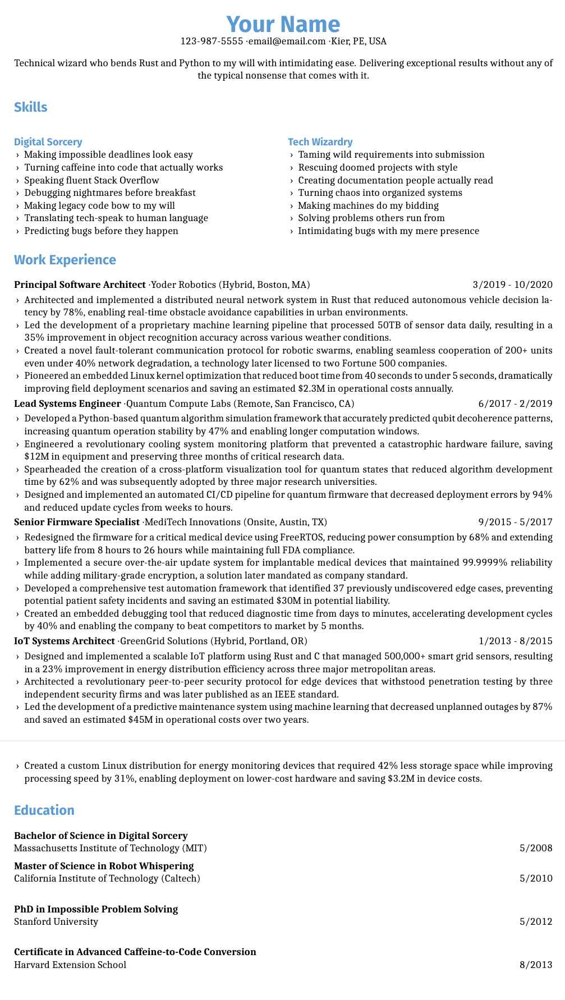

# LaTex Resume Template

I was tired of managing my resume in Microsoft Publisher, so I created this resume template as a way to more easily create and manage my job application process.  LaTex is a great tool for creating documents, but it can be tough to get things started and working well.  This repository is hopefully a good starting point!

## Outputs

The provided make commands produce both a pdf and a plain text file outputs.  

## Tips

- Add `\pagebreak` if needed to manually split the pages at a certain spot
- Adding `\hyphenpenalty=10000` basically disables hyphenation for a section
- Chose your own font!  I like `Caladea` but other Google Fonts should be available by default

## Dev Container

The provided dev container sets up `latexmk` which seems to be an easy way to create LaTex pdfs.  VS Code should be able to open this project inside the provided `.devcontainer` settings.

## Makefile

Run `make` to build the pdf and text version, and `make clean` to delete everything!

## Github Actions

On commits to main the action will generate the pdf and upload it as an artifact.

## Contributing

Contributions are welcome! Please feel free to submit pull requests with improvements or bug fixes.

## Example Output

